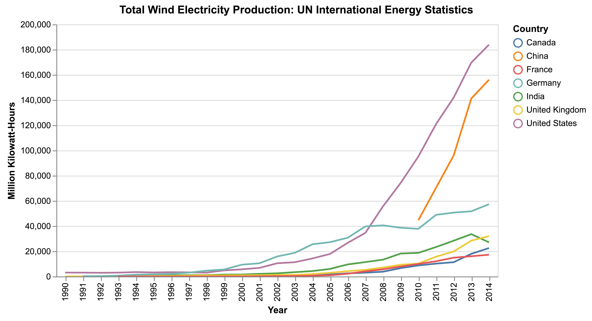
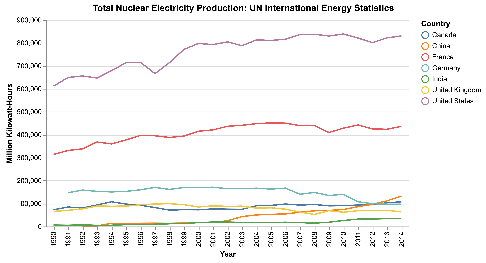
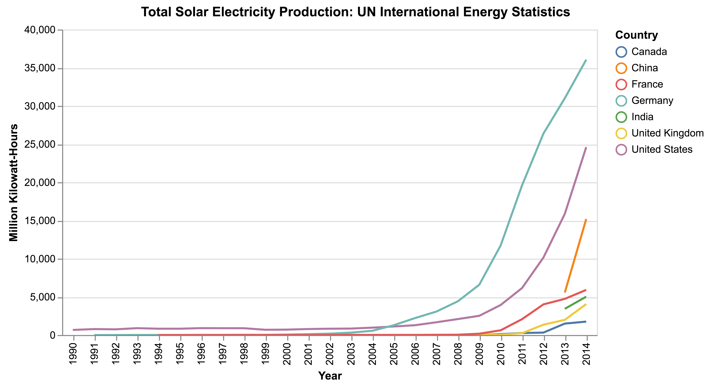
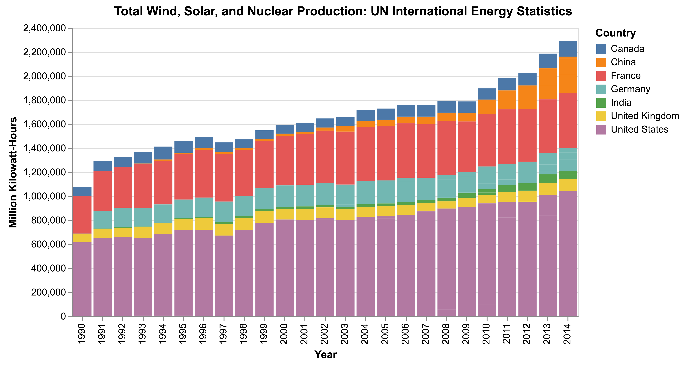
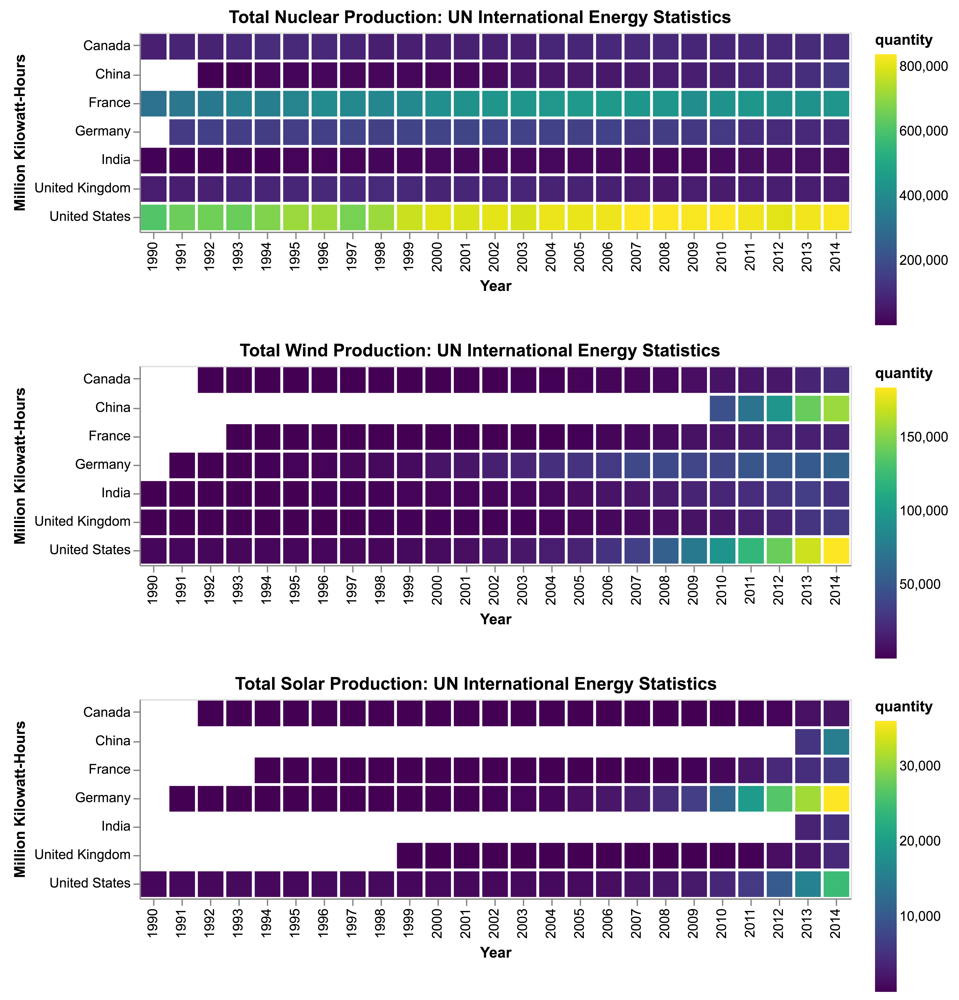

# EnergyViz
Visualization of Energy metrics for different nations

## Total Wind Energy

## Total Nuclear Energy

## Total Solar Energy

## Total Renewable Production Stacked

## Total Renewable Production Heatmap

